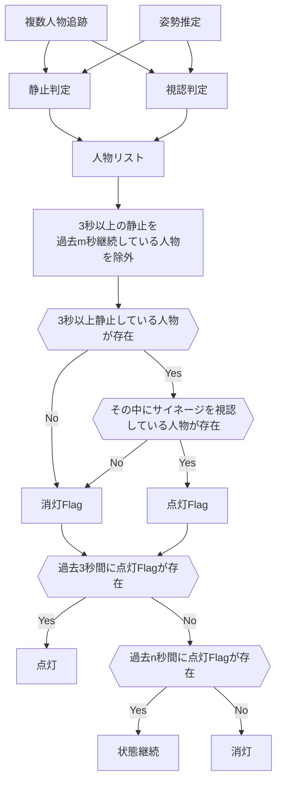
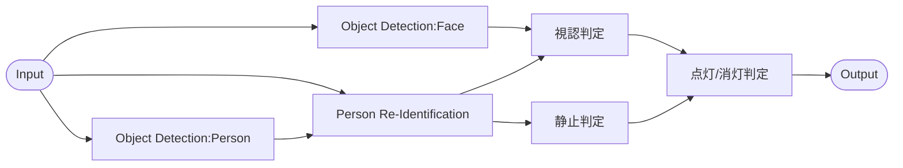
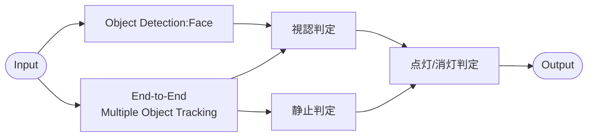
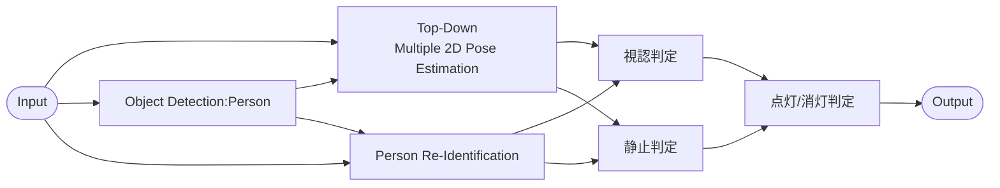
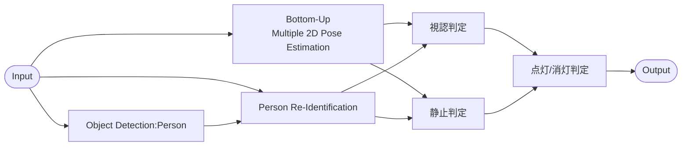
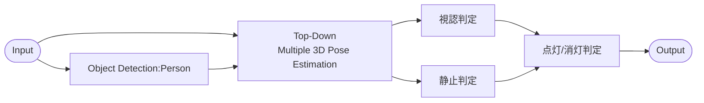
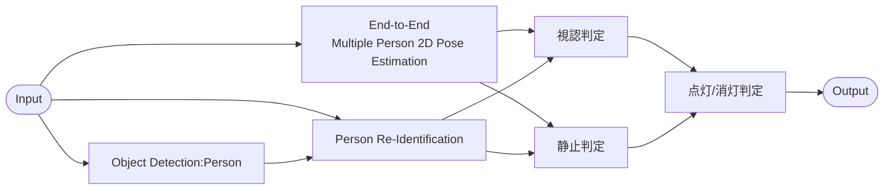
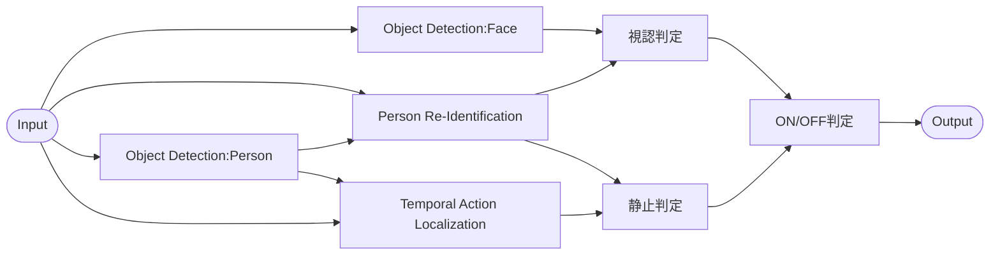

# 課題1 - 解決手法の検討

## 前提条件

リアルタイムで処理を行うこと。
カメラの位置は固定であること。
カメラに映る人数に制限がないこと。
商用利用であること。

## バックライト点灯タイミングでの注意点

立ち止まっている人物の前を通過する人物がいる場合等、検出が一時的に途切れる可能性がある。
そのため、一定の猶予(ex. 3秒の内95%以上立ち止まっていると判定される)が必要。

## バックライト消灯タイミング

条件として与えられている「サイネージ使用者から見た際の使い勝手」と「経費削減の効果」について、サイネージは見るものであるから、例えば顔を検出できる場合は使用している可能性があるため、点灯を継続すべきと考えた。
ただし、点灯を継続すると経費削減に反することから、サイネージを見終わる時間が既知であると仮定する。その時間以上立ち止まっているならば、既に見終わっているため消灯すべきと考えた。また、消灯条件を一定時間継続した場合に消灯する。

## 点灯/消灯の概略フロー図

3秒の静止を判定するため、現実的に複数人物の検出が必要となる。カメラに映る人物をMultipleに検出する場合、検出した全ての人物に対し静止判定を行った結果を一定時間保持するならば、カメラから最も近い人物を推定する必要はないと考える。
以上を踏まえ、複数人物が映る可能性を考慮した消灯フローは以下の通りである。

## 関連研究

上記条件から解決手法に用いることができる研究分野を調査した。

### Object Detection

画像に含まれるオブジェクトのBounding Boxとオブジェクト名を推定する。

論文例:  
You Only Look Once: Unified, Real-Time Object Detection[^1]  
YOLOX: Exceeding YOLO Series in 2021[^2]  
End-to-End Object Detection with Transformers[^3]

### Person Re-Identification

Bounding Boxの大きさや特徴量から、同一人物を識別する。

論文例:  
Simple Online and Realtime Tracking with a Deep Association Metric[^4]  

### Multiple Object Tracking

映像に対し、Object DetectionとPerson Re-Identificationを組み合わせることで、Bounding Boxとオブジェクト名、同一物体の識別を行う。  
End-to-EndにBounding Boxとオブジェクト名、関連付けを行う研究もされている。  

論文例:  
Simple Online and Realtime Tracking with a Deep Association Metric[^5]  
ByteTrack: Multi-Object Tracking by Associating Every Detection Box[^6]  
MOTR: End-to-End Multiple-Object Tracking with Transformer[^7]

### Multiple Person Pose Estimation

画像または映像に対し、人物毎に関節等のKey Pointを検出し、2Dまたは3Dで推定する。  

アプローチとして、Bottom-UpまたはTop-Downの2種類が主となる。  
Bottom-Up型は、Key Pointを検出後、人物毎にグルーピングする。低精度であるが、人数に依存せず高速。  
Top-Down型は、人物を検出後、人物毎にKey Pointを検出する。高精度であるが、低速。  
End-to-Endの推定も研究されている。

論文例:  
Rethinking the Heatmap Regression for Bottom-up Human Pose Estimation[^8]  
ViTPose: Simple Vision Transformer Baselines for Human Pose Estimation[^9]  
End-to-End Multi-Person Pose Estimation With Transformers[^10]  
Monocular, One-stage, Regression of Multiple 3D People[^11]

### Multiple Person Pose Tracking

映像に対し、Pose EstimationとPerson Re-Identificationを組み合わせてTrackingも行う。

論文例:  
LightTrack: A Generic Framework for Online Top-Down Human Pose Tracking[^12]  
AlphaPose: Whole-Body Regional Multi-Person Pose Estimation and Tracking in Real-Time[^13]  
XNect: Real-time Multi-Person 3D Motion Capture with a Single RGB Camera[^14]

### Temporal Action Localization
映像に対し、走る等の行動をしているオブジェクトのBounding Box、時間、行動名を推定する。

論文例:  
Argus++: Robust Real-time Activity Detection for Unconstrained Video Streams with Overlapping Cube Proposals[^15]

## モジュール
考えられる解決手法に必要なモジュールを列挙する。

1. Multiple Object Detectionを行うモジュール
2. Person Re-Identification(Tracking)を行うモジュール
3. Multiple Pose Estimationを行うモジュール
4. Temporal Action Localizationを行うモジュール
6. 3秒間人物が静止していることを判定(静止判定)するモジュール  
  入力例: 過去3秒の((Object Detection or Pose Estimation) + Person Re-Identification)  
  出力例: List(Boolean(Stopping or Not Stopping) + ID)  
  Object Detectionの場合、Boxの下端のy座標を中心に、Pose Estimationの場合下半身のKeypointsに限定し、3秒間の前フレームとの座標の差が一定距離以内である確率が基準以上かどうかで静止しているか判定する。
7. 人物がサイネージを見ていることを判定(視認判定)するモジュール  
  入力例: (Object Detection or Pose Estimation) + Person Re-Identification  
  出力例: List(Boolean(Watching or Not Watching) + ID)  
  Object Detectionの場合、Box内で顔を検出できるか、Pose Estimationの場合、目や鼻・口のKeypointsが存在するかどうかでサイネージを見ているか判定する。
9. 点灯/消灯を判定するモジュール  
  入力例:List(Boolean(Stopping or Not Stopping) + Boolean(Watching or Not Watching) + ID) + Boolean(点灯中 or 消灯中)  
  出力例: Boolean(On or Off)  

## 解決手法
上記モジュールを組み合わせることで、以下の解決手法が考えられる。なお、これらのフローはイメージで、論文や実装と異なる場合がある。

### 手法1.

Bounding Boxの変化量・移動量で立ち止まっているか判定する場合、このようなフローが考えられる。ただし、その場で足踏みをする・回転するといった動作に対応できないと考えられる。

### 手法2.

手法1について、Object DetectionとPerson Re-IdentificationをEnd-to-End Multiple Object Trackingに置き換えた場合、このようなフローが考えられる。

### 手法3.

Key Pointから立ち止まっているか・サイネージを見ているか判定する場合、このようなフローが考えられる。手法1より精度が高いと考えられる。なお、静止判定はこちらのページを参考にする。https://qiita.com/aframeworks-blog/items/afd768757e216de3bcf5

### 手法4.

手法3について、2D Pose EstimationをTop-DownからBottom-Upに置き換えた場合、このようなフローが考えられる。Bottom-Up Pose Estimationのため、Object Detectionを活かすことができない。

### 手法5.

手法3について、Pose Estimationを2Dから3Dに置き換えた場合、このようなフローが考えられる。2Dと比較すると、速度・精度が劣る。

### 手法6.

手法4について、Pose Estimationを2Dから3Dに置き換えた場合、このようなフローが考えられる。2Dと比較すると、速度・精度が劣る。

### 手法7.

手法3について、Object Detectionと2D Pose EstimationをEnd-to-End Multiple Person 2D Pose Estimationに置き換えた場合、このようなフローが考えられる。

### 手法8.

Temporal Action Localizationにより立ち止まっているか判定する場合、このようなフローが考えられる。手法1～5と比較しモジュールが増えるため、速度は遅いと考えられる。

## 手法選定
手法の選定にあたり、次の3つの条件を重視した。
1. 商用利用で問題になりにくい、以下のいずれかのライセンスであること。 
	1. MIT License
	2. The 3-Clause BSD License
	3. Apache License 2.0
2. リアルタイム、あるいはそれに近い状態で実行できる速度であること。
3. 予測精度が高いこと。

以上から、YOLOX, ByteTrack, ViTPoseを用いて手法3による実装を目指した。

[^1]: [Redmon, J., Divvala, S., Girshick, R., & Farhadi, A. (2016). You only look once: Unified, real-time object detection. In Proceedings of the IEEE conference on computer vision and pattern recognition (pp. 779-788).](https://www.cv-foundation.org/openaccess/content_cvpr_2016/papers/Redmon_You_Only_Look_CVPR_2016_paper.pdf)
[^2]: [Ge, Z., Liu, S., Wang, F., Li, Z., & Sun, J. (2021). Yolox: Exceeding yolo series in 2021. _arXiv preprint arXiv:2107.08430_.](https://arxiv.org/pdf/2107.08430.pdf) 
[^3]: [Carion, N., Massa, F., Synnaeve, G., Usunier, N., Kirillov, A., & Zagoruyko, S. (2020, August). End-to-end object detection with transformers. In _European conference on computer vision_ (pp. 213-229). Springer, Cham.](https://arxiv.org/pdf/2005.12872.pdf)
[^4]: [Wojke, N., Bewley, A., & Paulus, D. (2017, September). Simple online and realtime tracking with a deep association metric. In _2017 IEEE international conference on image processing (ICIP)_ (pp. 3645-3649). IEEE.](https://arxiv.org/pdf/1703.07402.pdf)
[^5]: [Wojke, N., Bewley, A., & Paulus, D. (2017, September). Simple online and realtime tracking with a deep association metric. In _2017 IEEE international conference on image processing (ICIP)_ (pp. 3645-3649). IEEE.](https://arxiv.org/pdf/1703.07402.pdf)
[^6]: [Zhang, Y., Sun, P., Jiang, Y., Yu, D., Weng, F., Yuan, Z., ... & Wang, X. (2022, October). Bytetrack: Multi-object tracking by associating every detection box. In _Computer Vision–ECCV 2022: 17th European Conference, Tel Aviv, Israel, October 23–27, 2022, Proceedings, Part XXII_ (pp. 1-21). Cham: Springer Nature Switzerland.](https://arxiv.org/pdf/2110.06864.pdf)
[^7]: [Zeng, F., Dong, B., Zhang, Y., Wang, T., Zhang, X., & Wei, Y. (2022). Motr: End-to-end multiple-object tracking with transformer. In _European Conference on Computer Vision_ (pp. 659-675). Springer, Cham.](https://arxiv.org/pdf/2105.03247)
[^8]: [Luo, Z., Wang, Z., Huang, Y., Wang, L., Tan, T., & Zhou, E. (2021). Rethinking the heatmap regression for bottom-up human pose estimation. In Proceedings of the IEEE/CVF Conference on Computer Vision and Pattern Recognition (pp. 13264-13273).](https://openaccess.thecvf.com/content/CVPR2021/papers/Luo_Rethinking_the_Heatmap_Regression_for_Bottom-Up_Human_Pose_Estimation_CVPR_2021_paper.pdf)
[^9]: [Xu, Y., Zhang, J., Zhang, Q., & Tao, D. (2022). ViTPose: Simple Vision Transformer Baselines for Human Pose Estimation. _arXiv preprint arXiv:2204.12484_.](https://arxiv.org/pdf/2204.12484v3.pdf)
[^10]: [Shi, D., Wei, X., Li, L., Ren, Y., & Tan, W. (2022). End-to-End Multi-Person Pose Estimation With Transformers. In _Proceedings of the IEEE/CVF Conference on Computer Vision and Pattern Recognition_ (pp. 11069-11078).](https://openaccess.thecvf.com/content/CVPR2022/papers/Shi_End-to-End_Multi-Person_Pose_Estimation_With_Transformers_CVPR_2022_paper.pdf)
[^11]: [Sun, Y., Bao, Q., Liu, W., Fu, Y., Black, M. J., & Mei, T. (2021). Monocular, one-stage, regression of multiple 3d people. In _Proceedings of the IEEE/CVF International Conference on Computer Vision_ (pp. 11179-11188).](https://openaccess.thecvf.com/content/ICCV2021/papers/Sun_Monocular_One-Stage_Regression_of_Multiple_3D_People_ICCV_2021_paper.pdf)
[^12]: [Ning, G., Pei, J., & Huang, H. (2020). LightTrack: A generic framework for online top-down human pose tracking. In _Proceedings of the IEEE/CVF Conference on Computer Vision and Pattern Recognition Workshops_ (pp. 1034-1035).](https://openaccess.thecvf.com/content_CVPRW_2020/papers/w70/Ning_LightTrack_A_Generic_Framework_for_Online_Top-Down_Human_Pose_Tracking_CVPRW_2020_paper.pdf)
[^13]: [Fang, H. S., Li, J., Tang, H., Xu, C., Zhu, H., Xiu, Y., ... & Lu, C. (2022). Alphapose: Whole-body regional multi-person pose estimation and tracking in real-time. _IEEE Transactions on Pattern Analysis and Machine Intelligence_.](https://arxiv.org/pdf/2211.03375.pdf)
[^14]: [Mehta, D., Sotnychenko, O., Mueller, F., Xu, W., Elgharib, M., Fua, P., ... & Theobalt, C. (2020). XNect: Real-time multi-person 3D motion capture with a single RGB camera. _Acm Transactions On Graphics (TOG)_, _39_(4), 82-1.](https://dl.acm.org/doi/pdf/10.1145/3386569.3392410)
[^15]: [Yu, L., Qian, Y., Liu, W., & Hauptmann, A. G. (2022). Argus++: Robust real-time activity detection for unconstrained video streams with overlapping cube proposals. In _Proceedings of the IEEE/CVF Winter Conference on Applications of Computer Vision_ (pp. 112-121).](https://openaccess.thecvf.com/content/WACV2022W/HADCV/papers/Yu_Argus_Robust_Real-Time_Activity_Detection_for_Unconstrained_Video_Streams_With_WACVW_2022_paper.pdf)
